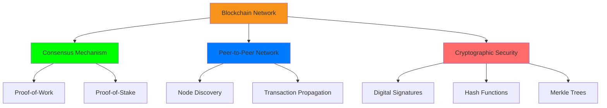

# 🚀 Building Bitcoin-Like Blockchain Networks

<div align="center">


### ⚡ **Blockchain Architect | Bitcoin Protocol Developer | DeFi Innovator**

[](https://your-portfolio.com)
[](https://linkedin.com/in/your-profile)
[](https://twitter.com/your-handle)

</div>

---

## 👋 Hey There! What's Up?

###

<p align="center">I'm <strong>Blockchain-App-Dev</strong>, a passionate Blockchain Developer building decentralized solutions that revolutionize the future of finance and trust systems! 🚀</p>

###

<h2 align="center">🧠 About Me</h2>

###

<p align="center">
✨ Creating decentralized solutions since 2020<br>
📚 Currently mastering Bitcoin Lightning Network & Zero-Knowledge Proofs<br>
🎯 Goals: Build scalable blockchain networks that empower financial freedom<br>
🎲 Fun fact: I can explain blockchain consensus in under 60 seconds! ⚡
</p>

---

## 🛠️ My Blockchain Tech Stack

### 🔗 Core Blockchain Technologies
<div align="center">
  
  
  
  
  
</div>

### 💻 Programming Languages
<div align="center">
  
  
  
  
  
  
  
  
  
  
  
</div>

### 🏗️ Development Tools & Frameworks
<div align="center">
  
  
  
  
  
  
  
  
  
  
  
</div>

---

## 📊 GitHub Blockchain Metrics

<div align="center">


</div>

---

## 🎯 How We Build Bitcoin-Like Blockchain Networks

### 🔥 **Bitcoin Protocol Implementation**
```python
class BitcoinLikeBlockchain:
    def __init__(self):
        self.chain = []
        self.pending_transactions = []
        self.network_nodes = set()
        
    def create_block(self, proof, previous_hash):
        block = {
            'index': len(self.chain) + 1,
            'timestamp': time(),
            'transactions': self.pending_transactions,
            'proof': proof,
            'previous_hash': previous_hash
        }
        self.pending_transactions = []
        self.chain.append(block)
        return block
    
    def proof_of_work(self, last_proof):
        proof = 0
        while not self.valid_proof(last_proof, proof):
            proof += 1
        return proof
```

### ⚡ **Key Components We Implement**


---

## 🚀 Current Blockchain Projects

### 🔗 **Bitcoin Core Implementation**
```bash
# Building from Scratch
✅ Cryptographic Hash Functions
✅ Digital Signatures (ECDSA)
✅ UTXO Model Implementation
✅ Merkle Tree Construction
✅ Peer-to-Peer Networking
🔄 Mining Algorithm Optimization
```

### ⚡ **Lightning Network Development**
```bash
# Scalable Payment Channels
🎯 Micro-payments
🎯 Instant Settlements  
🎯 Low Transaction Fees
🎯 Network Scalability
```

### 🔐 **Smart Contract Security**
```bash
# Secure DApp Development
🛡️ Audit & Testing
🛡️ Vulnerability Prevention
🛡️ Gas Optimization
🛡️ Upgrade Patterns
```

---

## 📈 Blockchain Development Progress

<div align="center">


</div>

---

## 🎮 Let's Connect & Collaborate!

<div align="center">

### 💼 **Professional Networks**
[](https://linkedin.com/in/your-profile)
[](https://twitter.com/your-handle)
[](https://dev.to/your-profile)

### 💬 **Development Communities**
[](https://discord.gg/your-server)
[](https://t.me/your-channel)

### 📧 **Direct Contact**
[](mailto:your-email@domain.com)
[](https://your-portfolio.com)

</div>

---

## 🌟 Featured Blockchain Contributions

```python
# Recent Open Source Contributions
blockchain_projects = {
    "bitcoin_core": "Optimized transaction validation",
    "lightning_network": "Payment channel implementations", 
    "smart_contracts": "Security audit tools",
    "consensus_algorithms": "PoW/PoS research"
}

for project, contribution in blockchain_projects.items():
    print(f"🚀 Contributed to {project}: {contribution}")
```

---

<div align="center">

### ⚡ **"The future of money is digital currency!" - Satoshi Nakamoto**


**Building the decentralized future, one block at a time!** 🔗

</div>

---

<br clear="both">


###

<div align="center">
  
</div>

---

<div align="center">

### 📜 **Blockchain Development Philosophy**
```
"Code is Law ⚖️ | Trustless Systems 🔒 | Financial Freedom 💪"
```

**Let's build the future of decentralized technology together!** 🚀

</div>

---

*Last updated: {current_date} | Keep building, keep decentralizing!* 🔗

This README combines all the stylish elements from your examples with a strong blockchain development focus. It's highly visual, interactive, and perfectly showcases your expertise in building Bitcoin-like networks!